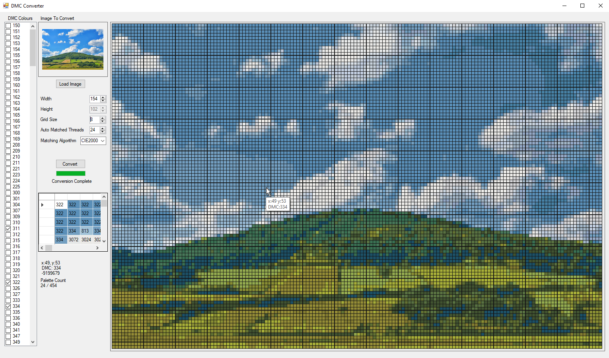

### [Latest Release](https://github.com/Ryason/DMC-Image-Converter/releases/tag/v0.05)
---
### About
DMC Image Converter is a tool used to create cross stitch patterns from images.
---

### Current Features
- Load an image and have it converted into a pattern for cross stitching with DMC floss.
- Automatic selection of best DMC threads to use, as well as user specified.
- Resize a loaded image to a set width.
- Display grid showing DMC values, representing the converted pixels of the loaded image.
- Select between different colour matching algorithms. Each gives a slightly different result. With the closeest current algorithm being [CIE2000](https://en.wikipedia.org/wiki/Color_difference#CIELAB_%CE%94E*). Although the closest mathematically, you may want to play around with what the other versions produce.
- [Dithering](https://en.wikipedia.org/wiki/Dither) (reduces colour banding caused by a reduced colour palette)
- Basic PDF export (still in development)
---
### Currently Working On
- Dithering
- Better auto colour matching (needs to be better at selecting colours. Just picking the most common is not good enough, as it potentially disregards low count colours that are important for the overall image).
- Load/save feature. Allowing the user to make a conversion, save it, and then re-load it the next time the launch the program. Without having to convert it again.
- Ability to draw your own pattern, or edit a conversion, using any DMC colour the user wants to (paint).
- Marking function, so the user can mark stitches on the grid that have been stiched.
- Figuring out the best way to save the conversion to either an image or pdf, for use away from the program.
- Re-arranging the ui and improving the overall look.
---
### How To Use
- Load an image into the application by clicking the Load Image button.
- Controll the size of your cross stich pattern by setting the width, with the width controll box.
- Select from the list of DMC values, which floss' you would like to use with your pattern.
- Or, select how many different threads you would like to use and the program will find the best suitable DMC colours.
- Check the dithering box if you would like the image to be dithered. Setting the value next to the check box controlls how much dithering you want to be applied (1.0 is standard)
- Pressing the convert button will start the image conversion and will result in the pattern being displayed on a large grid.
- You can right click any grid cell to mark it red when you have stitched it (currently can't unmark).
- Using the Save and Load buttons, you can save a pattern for loading if you need to close the program.
---
### Features I Would Like To Add
- Save and load previous conversions. As well as saving and loading of marked grid cells, to keep a users stitching progress.
- Bigger floss selection. Such as brands of floss other than DMC.
- Ability to see what the floss colours look like next to the selection panel.
- Track how long a user has been stitching a pattern, and estimate a completion date.
- Display what coloured floss is actually in the converted image, as the entire palette may not be used. Just because a colour has been selected, certain colours may never be matched to pixels in the users image.
- Track each colour floss and the amount required. With a display showing how many stitches of that colour are left to stitch in the image.
- Ability to save a converted iamage pattern to pdf in order to print it out.
- Update button that links to this project's repo, so users can get the latest version. (Could store version number in code and check against current release version number. Then alert if users exe is not the latest)
- Option to paint your own pattern using a pallet selector and drawing(clicking) directly on the grid.
