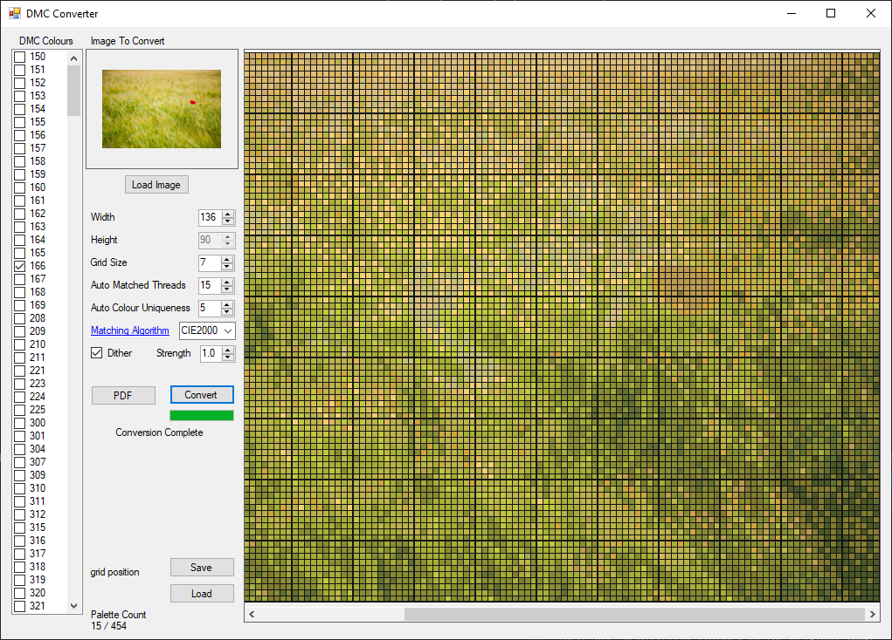
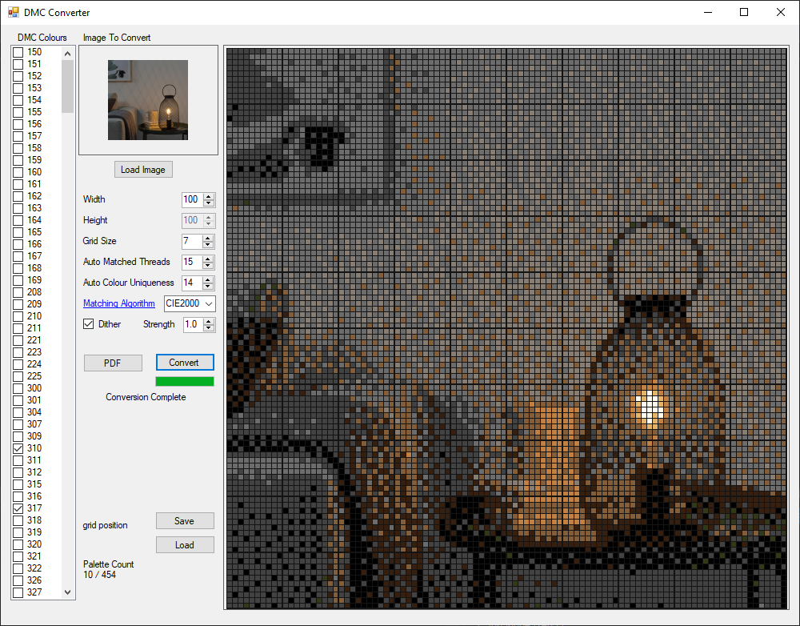

### [Latest Release](https://github.com/Ryason/DMC-Image-Converter/releases/tag/v0.06)
---
### About
DMC Image Converter is a tool used to create cross stitch patterns from images.
---

### Current Features
- Save and load converted images.
- Automatic selection of best DMC threads to use, as well as user specified.
- Image resizing
- Display grid showing DMC values (representing the converted pixels of the loaded image).
- Grid Marking to track stitching progress.
- Different colour matching algorithms. Each gives a slightly different result. With the closeest current algorithm being [CIE2000](https://en.wikipedia.org/wiki/Color_difference#CIELAB_%CE%94E*). Although the closest mathematically, you may want to play around with what the other versions produce.
- [Dithering](https://en.wikipedia.org/wiki/Dither) (reduces colour banding caused by a reduced colour palette)
- Basic PDF export (still in development)
- Save and load previous conversions and stitch markers.
---
### How To Use

- Load an image into the program by clicking the "Load Image" button.
- Controll the size of your cross stich pattern by setting the width, with the "Width" controll box.
- Select from the list of DMC values which colours you would like to use with your pattern.
- Or, select how many different threads you would like to use and the program will find the best suitable DMC colours.
- Check the dithering box if you would like the image to be dithered. 
- Setting the value next to the dithering check box controlls how much dithering you want to be applied (1.0 is standard)
- Pressing the "Convert" button will start the image conversion and will result in the pattern being displayed on a large grid.
- You can right click any grid cell to mark it red when you have stitched it.
- Right clicking a second time will unmark a grid cell.
- The save button will save any current conversion
- The load button will allow you to load a converion (The name of saves default to the converted iamge's name)
- Progress is saved automatically if grid cells are marked.
- Re-launching the program and clicking "Load Last" will open the last session.
---
### Currently Working On
- PDF export
- Ability to draw your own pattern, or edit a conversion, using any DMC colour the user wants to (paint).
- Figuring out the best way to save the conversion to either an image or pdf, for use away from the program.
- Re-arranging the ui and improving the overall look.
---
### About colour matching
The auto match colour feature gives the ability to generate a palette of DMC thread colours using the colours that make up the original image.

When using this you must trial different values of "colour uniqueness". This value determines how similar the auto matched colours are allowed to be. The larger the value, the more unique the colour palette becomes.

This was implemented upon realising that the first implementation only selected the top x amount of common colours. Which was an issue, as it severely reduced how varied the shades of colours in the palette were. For example, if converting an image of a large green field with a small amout of red flowers. The auto matched colours would include mostly greens, as this is the shade of colour that dominates the image. The palette would likely not have a shade of red, and the flowers would match to the closest possible colour (probably a shade of green).

The following figures show how the colour uniqueness of the auto matched colours effect the outcome of a conversion.

<pre>Uniqueness of 1                                                 Uniqueness of 5</pre>

 

<pre>Uniqueness of 9                                                 Uniqueness of 14</pre>

 

As shown, a default setting of 1 does not match some of the colours that only appear in small amounts. However, these colours that don't appear much are actually quite important in getting a decent conversion. As without them you lose a lot of the look that the original image had.

You also have to be cautious of setting the value too high. As doing so can result in too large of a similarity gap, resulting in not being able to find enough dissimilar colours in the original image. You can see this in the last of the 4 images above. If you maximize the image, you will see that the uniqueness value is set to 14, and in the bottom left, the palette count is only 8/454. Despite telling the program to match 15 colours. There are simply not enough unique colours in the image to comply with the set uniqueness value. Meaning the value needs to be reduced in order to get the desired number of matched colours.

---

### Features I Would Like To Add
- Bigger floss selection. Such as brands of floss other than DMC.
- Ability to see what the floss colours look like next to the selection panel.
- Track how long a user has been stitching a pattern, and estimate a completion date.
- Display what coloured floss is actually in the converted image, as the entire palette may not be used. Just because a colour has been selected, certain colours may never be matched to pixels in the users image.
- Track each colour floss and the amount required. With a display showing how many stitches of that colour are left to stitch in the image.
- Update button that links to this project's repo, so users can get the latest version.
- Option to paint your own pattern using a palette selector and drawing(clicking) directly on the grid.
